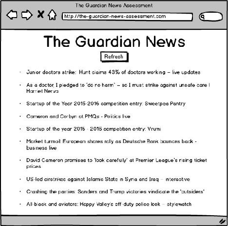

# The Guardian News Assessment

Test task for Levi9

## Link: https://permanentas.github.io/react-redux-gaurdian-news/

## Level 1

Create a web app that shows a list of 10 last news from The Guardian
API.

**Requirements**

- the page should contain a list of 10 last news;
- each list item should only include a title;
- news should be requested from The Guardian API on page load by using AJAX;
- if an error occurs during a request, a message should be shown.

**API**

      To access a list of 10 last news you can use this URL:
      http://content.guardianapis.com/search?api-key=test

## Level 2

Add refresh button on top of the news list.

**Requirements**

- the page should contain a refresh button before the news list;
- on a user clicks the refresh button, a new data should be requested from The Guardian API.

## Level 3

Add "accordion" with a short text of the news and a link to the article.

**Requirements**

- the page should contain an accordion with news title;
- on a user clicks a title, a data should be requested from The Guardian API about clicked news;
- when data arrives, a short text of the news and a link to the full article should be displayed
  in the block under the title;
- on a user clicks a title of already opened news, the content should be hidden;
- icons for opened and closed news should be different;
- an animation should be used for a slide down / slide up effect.

**API**

      To access a text of the news, you can use apiUrl from the list result
      with a show-blocks=body parameter like:
      http://content.guardianapis.com/small-business-network/2016/feb/
      22/startup-of-the-year-competition-entry-pavillion-at-the-park?showblocks=
      body&api-key=test

## Level 4

Add pagination block.

**Requirements**

- under the news list there should be a block with pagination that
  contains:
  - "< Previous Page" button;
  - an indicator of a current page: "[2] of 12421 pages", where
    the number of current a page is an input field;
  - "Next Page >" button;
- when a user clicks to the "< Previos Page" button, a news of
  previous page should be loaded;
- when a user clicks to the "Next Page >" button, a news of next
  page should be loaded;
- the indicator of a current page should show correct total pages
  number and current page number;
- when a user changed a current page number in the input and if
  the entered page exists, than entered page should be loaded.

**API**

- you can get a total number of pages from a response;
- you can pass a page number as a params to news endpoint
  as page=2 (http://content.guardianapis.com/search?page=2&api-key=test).

## API Documentation

Details about The Guardian API you can read at https://open-platform.theguardian.com/access/
